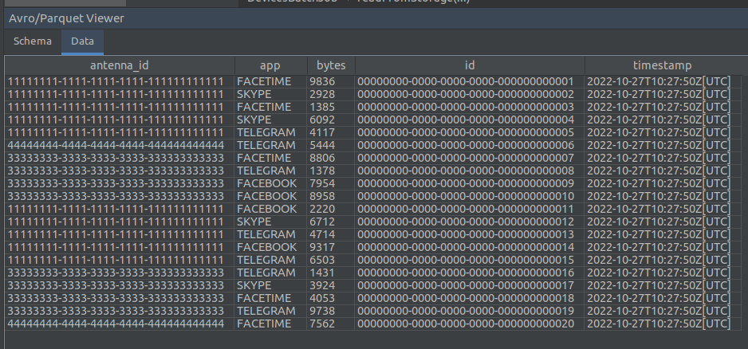
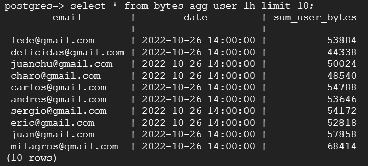
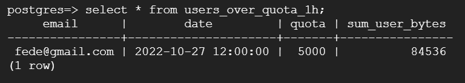

# Big Data Processing
## Proyecto final de Big Data Processing de Bernardo Koron

En este proyecto vamos a construir una [arquitectura lambda](https://en.wikipedia.org/wiki/Lambda_architecture) para el procesamiento de datos recolectados desde antenas de telefonía movil. Una arquitectura lambda se separa en tres capas:

* **Speed Layer**: Capa de procesamiento en streaming. Computa resultados en tiempo real y baja latencia.
* **Batch Layer**: Capa de procesamiento por lotes. Computa resultados usando grande cantidades de datos, alta latencia.
* **Serving Layer**: Capa encargada de servir los datos, es nutrida por las dos capas anteriores.

En nuestro proyecto usaremos las distintas tecnologías para cubrir los requisitos demandados por las distintas capas:

* **Speed Layer**: [Spark Structured Streaming](https://spark.apache.org/docs/latest/structured-streaming-programming-guide.html), [Apache Kafka](https://kafka.apache.org/), [Google Compute Engine](https://cloud.google.com/compute)
* **Batch Layer**: [Spark SQL](https://spark.apache.org/docs/latest/sql-programming-guide.html), [Google Cloud Storage](https://cloud.google.com/storage)
* **Serving Layer**: [Google SQL(PostgreSQL)](https://cloud.google.com/sql/docs/postgres), [Apache Superset](https://superset.incubator.apache.org/)

## Source of data

En este proyecto vamos a trabajar con 3 fuentes de datos:

1. Uso de datos de los dispositivos móviles.
2. Base de datos con información de los usuarios.

## Data flow

Es importante conocer el flujo de los datos y su comportamiento, en nuestro proyecto tenemos las 2 fuentes de datos mencionadas anteriormente:

La fuente 1 enviada desde las antenas son una fuente de datos en realtime que llegaran al sistema de mensajes de Apache Kafka. En nuestro proyecto vamos a usar un simulador que enviara información sobre 5 antenas y 20 dispositivos móviles a Kafka.

* Información de los dispositivos móviles -> KAFKA_TOPIC: `devices`

Por otro lado, tenemos la fuente (2) que son las base de datos, que suelen ser modificadas por operarios a través de un servidor web (ingenieros que administran las antenas, comerciales que registran nuevos clientes, etc). En nuestro proyecto usaremos un provisionador que rellenara las tablas con información estática que tiene relación con la fuente 1.

# Desarrollo
Para iniciar el proyecto se debe iniciar la instancia SQL de GCP y luego ejecutar el archivo "jdbcProvisioner.scala" que creara las tablas que luego seran utilizadas, y tambien carga las filas de la tabla de metadata "user_metadata".
Luego hay que enceder la maquina virtual donde se ejecutara Kafka, que genera un stream de datos que seran leidos por Scala.
El programa de Scala se suscribe al topic "devices" de Kafka para poder consumir esos datos.
Los datos leidos son parseados a formato Json y guardados en formato parquet, para que luego puedan ser leidos por el proceso Batch.

Directorios generados con archivos .parquet

Contenido de un archivo .parquet

Los datos en formato Json son enriquesidos con metadata obtenida de la tabla "user_metadata" de la base de datos. 

Luego con esos datos ya enriquesidos, se realizan las agregaciones y los resultados son guardados en las tablas "bytes_agg_antenna", "bytes_agg_user" y "bytes_agg_app" de la base de datos.

Por otra parte, el proceso Batch lee los archivos parquet, para una determinada hora en particular, y con esos datos realiza las agregaciones, cuyos resultados son guardados en la base de datos, en las tablas "bytes_agg_antenna_1h", "bytes_agg_user_1h", "bytes_agg_app_1h" y "users_over_quota_1h".

Aqui se puede ver la respuesta de la query donde se consulta cuales usuarios sobrepasaron su limite de consumo, Mostrando los valores del consumo y de su limite.
