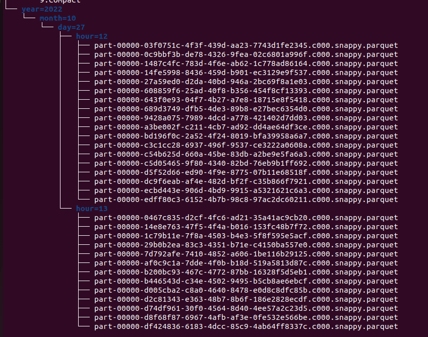

# Big Data Processing
## Proyecto final de Big Data Processing de Bernardo Koron

Para iniciar el proyecto se debe iniciar la instancia SQL de GCP y luego ejecutar el archivo "jdbcProvisioner.scala" que creara las tablas que luego seran utilizadas, y tambien carga las filas de la tabla de metadata "user_metadata".
Luego hay que enceder la maquina virtual donde se ejecutara Kafka, que genera un stream de datos que seran leidos por Scala.
El programa de Scala se suscribe al topic "devices" de Kafka para poder consumir esos datos.
Los datos leidos son parseados a formato Json y guardados en formato parquet, para que luego puedan ser leidos por el proceso Batch.
Los datos en formato Json son enriquesidos con metadata obtenida de la tabla "user_metadata" de la base de datos. 

Luego con esos datos ya enriquesidos, se realizan las agregaciones y los resultados son guardados en las tablas "bytes_agg_antenna", "bytes_agg_user" y "bytes_agg_app" de la base de datos

Por otra parte, el proceso Batch lee los archivos parquet, para una determinada hora en particular, y con esos datos realiza las agregaciones, cuyos resultados son guardados en la base de datos, en las tablas "bytes_agg_antenna_1h", "bytes_agg_user_1h", "bytes_agg_app_1h" y "users_over_quota_1h".

